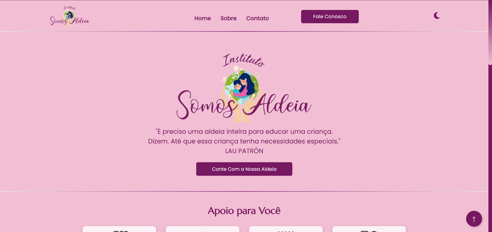

# Instituto Somos Aldeia | Website

Este repositório contém o site do **Instituto Somos Aldeia**, desenvolvido com **HTML**, **CSS** e **JavaScript puro**.
O objetivo é apresentar o grupo de apoio às mães atípicas e as iniciativas da organização.  

🔗 **Acesse online:** [institutosomosaldeia.vercel.app](https://institutosomosaldeia.vercel.app/)  




---

## 🧱 Tecnologias utilizadas

- **HTML5** — estrutura do site  
- **CSS3** — estilização visual e responsiva  
- **JavaScript Vanilla** — interações simples  
- **Vercel** — deploy e hospedagem automática

---

## 📁 Estrutura do projeto

```

├── index.html                 # Página inicial
├── assents/
│   ├── html/
│   │   ├── contato.html       # Página de contato
│   │   ├── sobre.html         # Página sobre
│   │   └── obrigado.html      # Página de agradecimento
│   ├── css/
│   │   └── style.css          # Estilos do site
│   ├── js/
│   │   └── script.js          # Scripts JavaScript
│   └── img/
│       └── Print.png          # Imagens e logos usados
└── README.md


````

---

## 🚀 Como executar localmente

1. Clone este repositório:
```bash
git clone https://github.com/AmandaSserena/Aldeia.git
cd Aldeia
````

2. Abra o arquivo:

```bash
assents/html/index.html
```

em seu navegador (pode clicar duas vezes ou usar o Live Server no VSCode).

---

## 👩‍👧‍👧 Sobre o Instituto

O **Instituto Somos Aldeia** é um grupo de apoio às mães atípicas da cidade de Torres/RS, promovendo acolhimento e empatia entre familiares de crianças com deficiência.
O projeto organiza encontros, eventos, práticas terapêuticas e promove redes de apoio emocional.

---

## 🌐 Seções do site

* **Home** — Apresentação institucional
* **Quem Somos** — Missão, visão e história
* **Contato** — Formas de entrar em contato com o Instituto

---

## ✨ Funcionalidades

* Interface leve e amigável
* Totalmente responsivo
* Menu fixo e interações com JavaScript

---

## 📌 Melhorias sugeridas

* Formulário de contato funcional
* Seção de blog ou notícias
* Integração com redes sociais
* Tema escuro (modo noturno)

---


## 📬 Contato

Desenvolvido por **Amanda Serena**
🌐 [institutosomosaldeia.vercel.app](https://institutosomosaldeia.vercel.app/)

---

## 🧾 Licença

Este projeto está sob a licença **MIT**.
Sinta-se livre para usar como base para projetos semelhantes.

---
